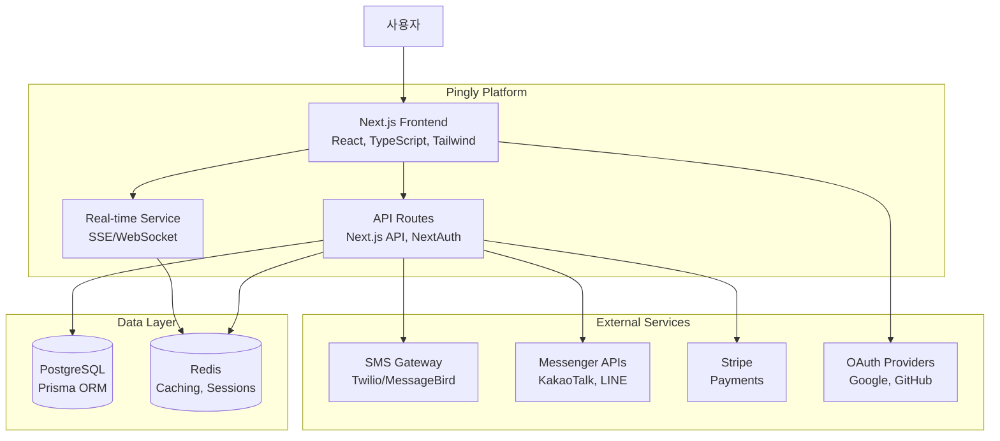

# Pingly 시스템 아키텍처 (Container Diagram)

## C4 Level 2: Container Diagram



## 컴포넌트 설명

| 컨테이너 | 기술 스택 | 역할 |
|---------|----------|------|
| **Frontend** | Next.js 14, React 18, TypeScript, Tailwind CSS | 사용자 인터페이스, 대시보드 |
| **API Routes** | Next.js API Routes, NextAuth.js | 비즈니스 로직, 인증, 외부 API 연동 |
| **Real-time** | Server-Sent Events (SSE) | 실시간 알림, 캠페인 상태 업데이트 |
| **PostgreSQL** | PostgreSQL 15, Prisma ORM | 주요 데이터 저장 (사용자, 캠페인, 연락처) |
| **Redis** | Redis 7 | 세션 캐싱, 실시간 이벤트 Pub/Sub |

## 데이터 흐름

### 캠페인 생성 흐름
```
사용자 → Frontend → API → DB 저장 → 응답
```

### 메시지 발송 흐름
```
API → SMS Gateway → 발송 결과 → DB 업데이트 → Real-time → Frontend 알림
```

### 인증 흐름
```
사용자 → Frontend → NextAuth → OAuth Provider → 세션 생성 → DB 저장
```

## 확장 고려사항

### 현재 (MVP)
- 단일 Vercel 인스턴스
- 단일 PostgreSQL 인스턴스
- 인메모리 캐싱

### 향후 (Scale)
- Vercel Edge Functions 활용
- PostgreSQL Read Replica
- Redis 클러스터
- 메시지 큐 (BullMQ) 도입
